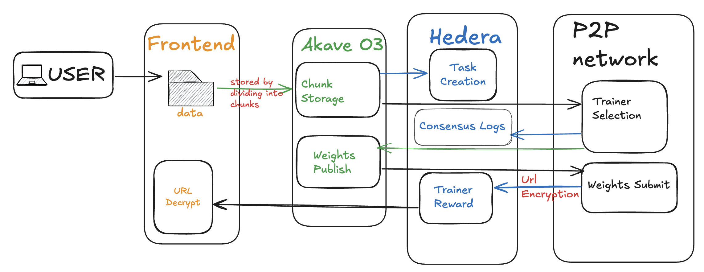

# P2P Federated Learning

A **peer-to-peer federated learning platform** where **ML users** can train models affordably, and trainers with idle compute resources can monetize their CPUs/GPUs. The system leverages **Hedera blockchain, Akave O3 decentralized storage,** and **py-libp2p** networking for trust, transparency, and efficiency.

---

## Table of Contents
- [P2P Federated Learning](#p2p-federated-learning)
- [Table of Contents](#table-of-contents)
  - [Getting Started](#getting-started)
    - [Prerequisites](#prerequisites)
    - [Installation](#installation)
  - [Usage](#usage)
    - [Target Users](#target-users)
    - [Interfaces](#interfaces)
  - [Implementation Details](#implementation-details)
    - [Technologies Used](#technologies-used)
    - [Architecture](#architecture)
  - [Presentation Link](#presentation-link)
  - [Demo Video Link](#demo-video-link)
  - [Frequently Asked Questions](#frequently-asked-questions)


## Getting Started
These instructions will help you get a copy of the project up and running on your local machine.
    - #### Frontend
      - Node.js
      - React.js
      - yarn
    - #### Akave O3 keys
      - AWS_ACCESS_KEY_ID
      - AWS_SECRET_ACCESS_KEY
      (You can get the Akave credentials in [https://docs.akave.xyz/akave-o3/introduction/akave-environment/])
    - #### Hedera Keys
      - OPERATOR_ID
      - OPERATOR_KEY
### Installation
- ### Frontend
  1. Clone the repository:

      ```
      git clone https://github.com/me/your-repositry
      ```

  2. Change to the project directory:

      ```
      cd your-repository/frontend
      ```

  3. Install the dependencies:

      ```
      yarn
      ```
  4. Populate env 
     ```
      AWS_ACCESS_KEY_ID // you can get from akave [website](https://docs.akave.xyz/akave-o3/introduction/akave-environment/)
      AWS_SECRET_ACCESS_KEY
      API_KEY
      API_SECRET
      JWT_TOKEN
     ```
     
- ### P2P Network


## Usage
- ### Target Users
**1. ML User (The Researcher/Builder)**
- Wants to train ML models but lacks resources.
- Easy onboarding with just a Hedera wallet (HashPack mobile app).
- Simply upload dataset + model → receive trained weights ready for integration.
  
**2. Trainer (The Gamer/Compute Provider)**
- Has underutilized GPUs/CPUs (e.g., gaming rigs).
- Earns money by contributing compute power to train ML models.
- Competes with other trainers, creating a competitive pricing market.

- ### Interfaces
- You can train the model using the frontend GUI (**Graphical User Interface**) or by downloading the application deployed on [Link]().
- You can also use the public API provided (or host your own) for P2P info and use the CLI for training and uploading the dataset and model to decetralised storage 
    1. ##### API
    1. #####  CLI


## Implementation Details
- ### Architecture
 
- ### Technologies Used
  **1. Akave O3**
  - Provides terminal-level **access to decentralized storage**.
  - **Uses presigned URLs** → allows downloading without AWS CLI or extra dependencies.
    
  **2. Hedera Blockchain**
  - **Payments**: Trainers rewarded directly in HBAR.
  - **State Management**: Training tasks emit Hedera events (start/end), fetched by frontend.
  - **Consensus Logging**: Trainer node logs are stored in a Hedera topic → resilient and cheap for debugging.
    
  **3. py-libp2p**
  - Provides reliable **peer-to-peer communication** between nodes.
  - Ensures decentralized **orchestration** of federated learning tasks.
    


## Presentation Link
- ### High-Level Flow
1. The ML user uploads their model and dataset through the frontend.
2. The dataset is split into chunks and each chunk is stored on Akave O3.
3. The platform generates presigned URLs for the chunks and publishes the training task to the P2P network using those URLs.
4. Trainer nodes compete (bid) to accept and run the training job using the chunk URLs.
5. Hedera smart contracts manage escrow, payments and record task state (start, progress, completion) on-chain.
6. Once training is complete, the resulting weights are uploaded to Akave O3 and the ML user receives encrypted presigned URL(s) to download the final model weights.
   
**Click [here](https://drive.google.com/file/d/19EcxHgoRgxPj2fVTqyghJm2dEKWvlDyh/view?usp=sharing)** to view the full **presentation**!


## Frequently Asked Questions
**Q1: Are the weights authentic?**
- Only authorized account addresses can publish weights.
- Malicious trainers risk losing their stake if they attempt to submit fraudulent weights.

- Future Enhancements:
  - Mandatory Trusted Execution Environments (TEE) for trainers.
  - Introduction of Validator Nodes to verify the authenticity of published weights.

**Q2: Why not just use AWS instances?**
- Requires prior knowledge of cloud setup.
- Our trainer-competition model ensures lower costs compared to AWS.

**Q3: Are the dataset and model exposed during training?**
- No. Only encrypted presigned URLs of dataset chunks are published to the Hedera network.
- When weights are published on Hedera, the URL is stored in encrypted form.
- The frontend decrypts the URL so that only the ML user has access to the final weights.


# CLOUD API

```bash
curl -X POST http://localhost:9000/command \
    -H "Content-Type: application/json" \
    -d '{"cmd":"publish","args":["fed-learn","hello"]}'

curl -X POST http://localhost:9000/command \
    -H "Content-Type: application/json" \
    -d '{"cmd":"bootmesh"}'

curl -X POST http://localhost:9000/command \
    -H "Content-Type: application/json" \
    -d '{"cmd":"mesh"}'

curl http://localhost:9000/status
```
